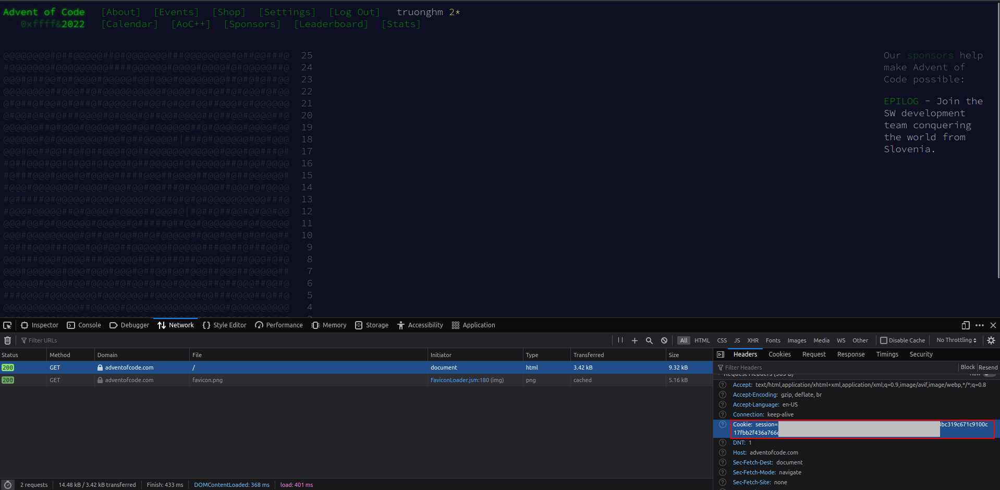

# Advent of Code Solutions

## Set up

1. Run solution:

```
# python solve.py --day=<day> --year=<year>
```

`<day>` can be formatted as __DD__ or __D__. `<year>` is formatted as __YYYY__. They are also not compulsory, and if they are not provided, the current day and year will be used.


2. Add solutions: Add to appropriate directories: For example, the solution for the first day of 2022 is located at [./solutions/aoc2022/s202201.py](./solutions/aoc2022/s202201.py).

3. ~~Save input: Download and save manually at [./input](./input/). Follow the naming convention of previous input files (`input/YYYY/input_YYYYMM.txt`)~~ Run the following command to download the input:

```
python dl.py --day=<day> --year=<year>
```

## How to automatically download input

Note that it's not encouraged to automatically download input for each puzzle. If you have to do it, do it only ONCE for each puzzle!

First, install `python-dotenv` by running `pip install -r requirements.txt` or `pip install python-dotenv`.

You will need the session ID of a logged in session for [https://adventofcode.com/](https://adventofcode.com/). Once logged in, find the session ID here:



Put that ID into an .env file like this:

```
SESSION_ID="some very long string"
```

Then run `python dl.py --day=<day> --year=<year>` as instructed above.